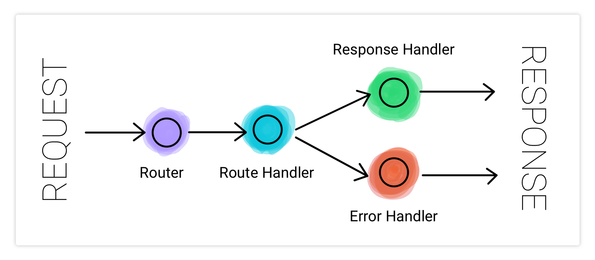
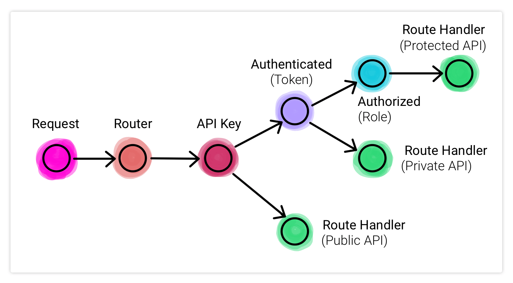

# Trip&trep

## Description

>A full Stack web application made for tour lover (travelers) to book,create,update,delete tours and use related functionality. All members have diff rights & restrictions, they operate a application according to their roles.

>When I was working on this project, I learned advanced features of _**NODE.js**_ and _**MongoDB**_, and now I have clear foundation knowledge with advanced stuff

## Some Key Features I Learned

* **Create Secure API**
* **How _**Node**_ works Behide the scenes**
    * NODE Processes ,Threads Thread Pool
    * Event Loop
    * Event-Driven architecture
    * Streams
* _**MongoDB with Mongoose**_
    * Aggregation pipeline
    * virtual properties
    * Document middleware
    * Query middleware
    * Aggregation middleware
    * Built-In Data validators
    * Custom Data validators
* _**Advanced Mongoose**_
    * **GeoSpatial Data** ( GeoJSON )
    * Populating, virtual Populating
    * Nested Routes
    * Reference/Normalized and Embedded/Denormalized
        * Child Refernecing
        * Parent Refernecing
        * Two-way Refernecing
        
        
* _**Authentication, Authorization and Security**_
    * Authentication with JWT Works
    * Authorization User Roles and Permissions
    * Password Reset Functionality Reset Token, Send by mail
    * JWT Cookies
    
    
* _**Global Error Handler**_ 
    * separate according to production and development, test environment standard
* _**Resuable Code (Factory Functions)**_ 
* _**All about middleware**_ 
* _**Mail**_, _**Maps**_, _**Payment Gateway**_ 
* _**Server Side Rendering**_

## 3RE Architecture

***

***


# Some restricted and protected routes 
**Some restricted (Have access)**
|  Operation      | admin                                              | Lead-Guide                                         | Guide  | User   |
|    :---         | :----:                                             | :----:                                             | :----: | :----: |
| Create Tour     |  |  |        |        |
| Update Tour     |  |  |        |        |
| Delete Tour     |  |  |        |        |
|
| Get All User    |  |    |        |        |
| Get User        |  |    |        |        |
| Create User     |  |    |        |        |
| update User     |  |    |        |        |
| delete User     |  |    |        |        |
|
| Get all Booking |  |  |        |        |
| Get Booking     |  |  |        |        |
| Create Booking  |  |  |        |        |
| Update Booking  |  |  |        |        |
| Delete Booking  |  |  |        |        |
| 
| Update Review   |  |                                                    |        |  |
| Create Review   |                                                    |                                                    |        |  |


## **How to build and run this project**
1. Clone this repository.
2. Execute npm install
3. Make sure _**MongoDB**_ is installed your system.
4. Create config.env in Root folder and provide following properties.
    ```javascript
        // # NODE_ENV=production
        NODE_ENV=development
        PORT=
        USER=
        // if you are using cluster, first replace password by <PASSWORD> in a given cluster link
        DATABASE=mongodb+srv://name:<PASSWORD>@cluster0.nwlxa.mongodb.net/dbname?retryWrites=true&w=majority
        DATABASE_PASSWORD=
        JWT_SECRET=
        JWT_EXPIRES_IN=90d
        JWT_COOKIE_EXPIRES_IN=90

        //# while you are in development you can use mailtrap.io 
        EMAIL_USERNAME=
        EMAIL_PASSWORD=
        EMAIL_HOST=smtp.mailtrap.io
        EMAIL_POST=2525
        EMAIL_FROM = mail_example@ail.io

        //# while you are in production you use any SMTP server servies
        // I used this "Sendinblue"
        SENDINBLUE_USERNAME=
        SENDINBLUE_PASSWORD=
        SENDINBLUE_HOST=
        SENDINBLUE_PORT=

        //# remove all comments

    ```
    ### If you want to use local DB

    1.  ```javascript 
            // Difine this property in config.env file
            1. DATABASE_LOCAL=mongodb://localhost:27017/Trip&trep 
        ```
    2. **Go To server.js file**

        Replace this
        ```javascript
            const DB = process.env.DATABASE.replace(
                            '<PASSWORD>',
                            process.env.DATABASE_PASSWORD
                        );
        ```
        With this
        ```javascript
            const DB = process.env.DATABASE_LOCAL
        ```
5. **To Load the dump data**
    ### If you want to use local DB, else skip this step
    * **Go To dev-data/data/import-dev-data.js file**

        Replace this
        ```javascript
            const DB = process.env.DATABASE.replace(
                            '<PASSWORD>',
                            process.env.DATABASE_PASSWORD
                        );
        ```
        With this
        ```javascript
            const DB = process.env.DATABASE_LOCAL
        ```

    ### Run this command in root in terminal (Run this script)
    ```
        node .\dev-data\data\import-dev-data.js --import
    ```
6. **If you want to delete dump data**

    ### Run this command in root folder in terminal (Run this script)
    ```
        node .\dev-data\data\import-dev-data.js --delete
    ```
7. **Execute ```npm start```**

## **Project Directory Structure**
```bash
    ├── controllers
    │   ├── authController.js
    │   ├── bookingController.js
    │   ├── errorController.js
    │   ├── handlerFactory.js
    │   ├── reviewController.js
    │   ├── tourController.js
    │   ├── userController.js
    │   └── viewsController.js
    ├── dev-data
    │   ├── data
    │   │   ├── import-dev-data.js
    │   │   ├── reviews.json
    │   │   ├── tours.json
    │   │   └── users.json
    │   └── img
    ├── models
    |   ├── bookingModel.js
    |   ├── reviewModel.js
    |   ├── tourModel.js
    |   └── userModel.js
    ├── public
    |   ├── css
    |   ├── img
    |   ├── js
    |   ├── overview.html
    |   └── tour.html
    ├── routes
    |   ├── bookingRoute.js
    |   ├── reviewRoute.js
    |   ├── tourRoute.js
    |   ├── userRoute.js
    |   └── viewRoute.js
    ├── utils
    |   ├── apiFeatures.js
    |   ├── appError.js
    |   ├── catchAsync.js
    |   └── email.js
    ├── .eslintrc.json
    ├── .gitignore
    ├── .prettierrc
    ├── app.js
    ├── config.env
    ├── package-lock.json
    ├── package.json
    ├── README.json
    └── server.js
```

# API Examples

## **API LIST**
```bash
    ├── Tours 
    │   ├── Get a single tour
    │   ├── Get all tours
    │   ├── create a new Tour
    │   ├── Update tour
    │   ├── delete tour
    │   ├── tour-stats
    │   ├── monthly plan
    │   ├── Get tours within radius
    │   └── Get Distance to Tours from Point
    ├── Users
    │   ├── Get User
    │   ├── Get all user
    │   ├── Update current user Data
    │   ├── Update user
    │   ├── delete  current user
    │   ├── delete users
    │   └── Get current user
    ├── Authentication
    │   ├── Forgot Password
    │   ├── Reset Password
    │   ├── update Password
    │   ├── Log In
    │   └── Sign Up
    ├── Review
    │   ├── Get Review
    │   ├── Get all Review
    │   ├── create Review
    │   ├── Update Review
    │   └── delete Review
    ├── Bookings
    │   ├── Get Bookings
    │   ├── Get all Bookings
    │   ├── create Bookings
    │   ├── Update Bookings
    │   └── delete Bookings
    ├── Tours/Reviews
    │   ├── Create New Review on tour
    │   └── Get all reviews on tour
        
```
**Routes**
```javascript
    app.use('/api/v1/tours', tourRouter);
    app.use('/api/v1/users', userRouter);
    app.use('/api/v1/reviews', reviewRouter);
    app.use('/api/v1/bookings', bookingRouter);
```

for local server

* {{Port}}=3000
* {{URL}} = http://127.0.0.1:{{Port}}/
* API = {{URL}}api/v1/tours
* API = {{URL}}api/v1/users
* API = {{URL}}api/v1/reviews
* API = {{URL}}api/v1/tourbookingss
### Sign Up 
```javascript
    method: 'post',
    url: '{{URL}}api/v1/users/signup',
    headers: { },
    data : data
```
* Request Body 
```javascript
    {
        "name":"",
        "email":"",
        "password":"",
        "passwordConfirm":""
    }
```
* Response
```javascript
    {
        status:'success',
        token,
        data:{
            user
    }
```


[API Doc](https://documenter.getpostman.com/view/17229398/TzzHnDae)


# FrontEnd part under Devlopment phase
* Support it by clicking the 🌟 button on the upper right of this page. ❤️
